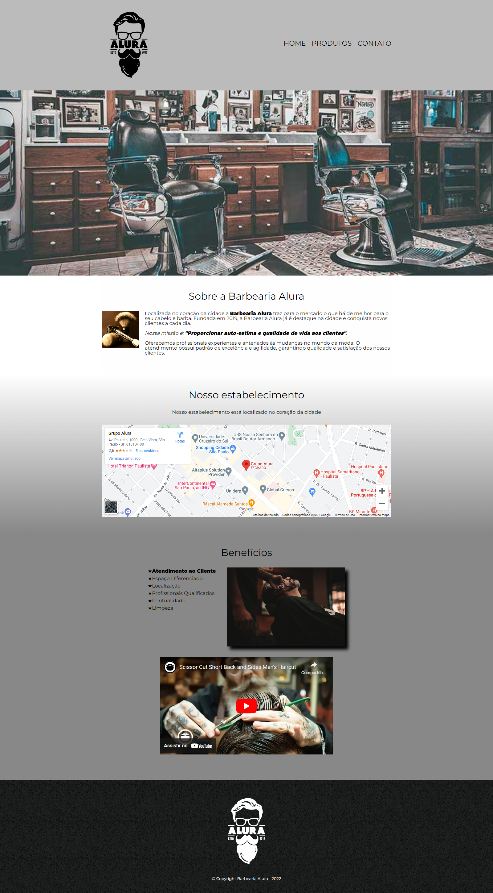
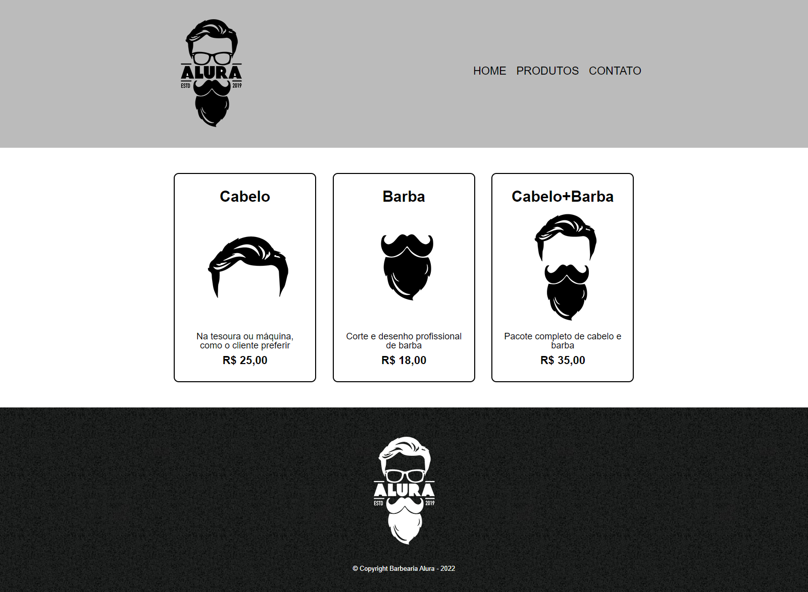
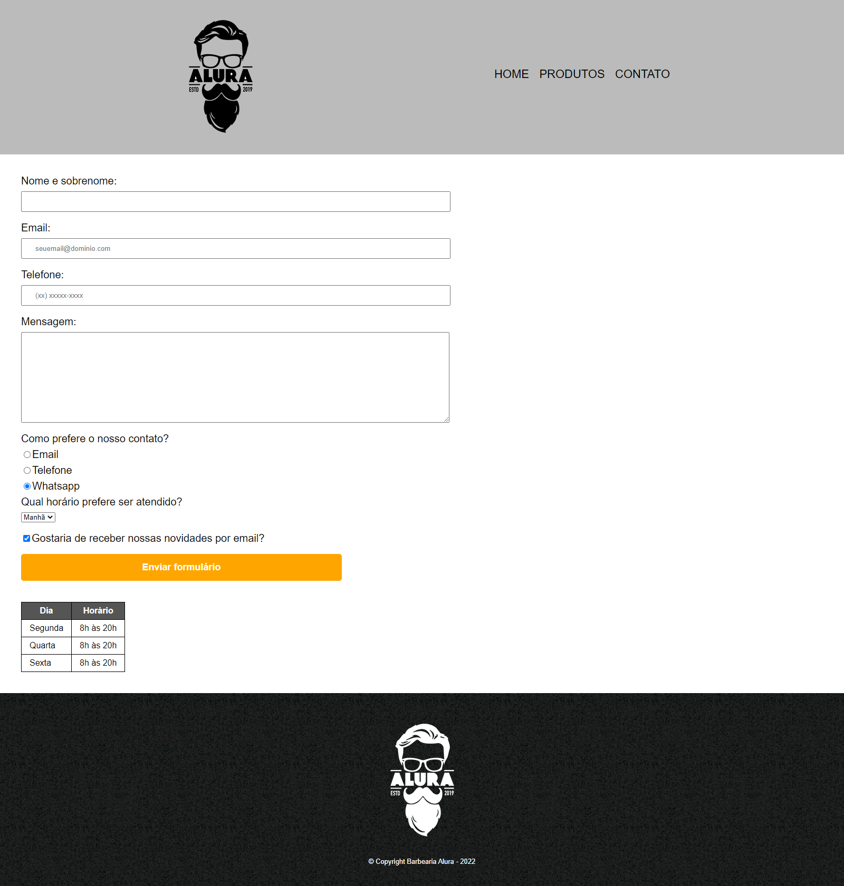

# Empower Code
## O que é
O Empower Code for Women é um programa de formação front-end realizado pela empresa Zenvia em parceria com a Alura, uma escola de tecnologia. O bootcamp tem como finalidade capacitar e mentorar 100 mulheres para a área de tecnologia.
## Tecnologias utilizadas

  
  
  
  

## O Projeto
O projeto realizado durante o curso consistiu no desenvolvimento de uma interface web para uma Barbearia. O site conta com uma página de Home, com informações sobre a barbearia e sua localização, uma página de Produtos oferecidos e uma página de Contatos, na qual há um formulário para preenchimento. O resultado pode ser conferido abaixo:
 
 

  
   
   
  
   
   
  

